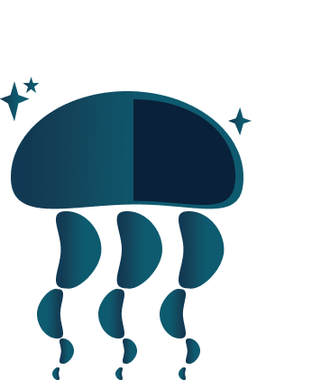
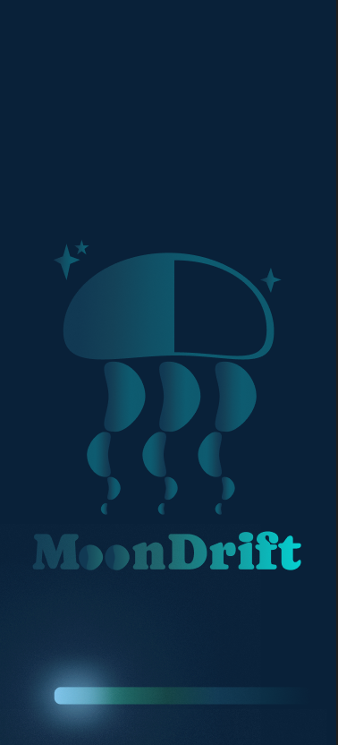
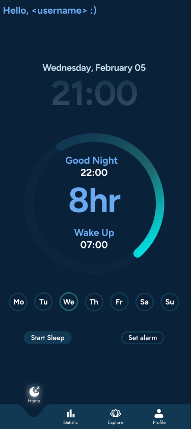
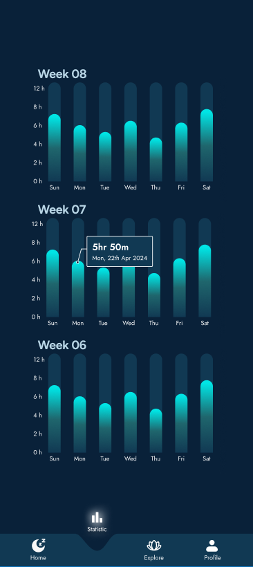
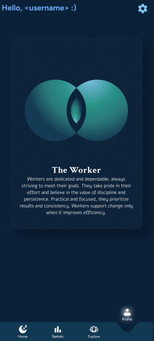
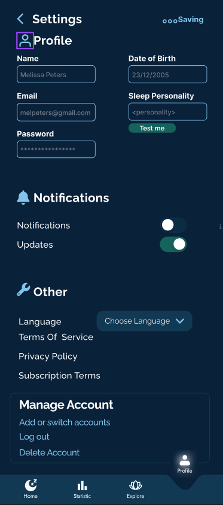
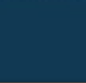
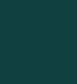
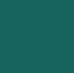
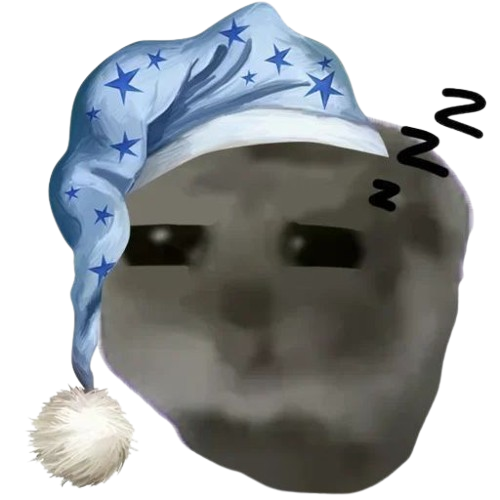

  
  <h1>MoonDrift</h1>
  
<h2> ❗❗ This project is not an official project but rather a personal practice project. I am a beginner, and this is my first independent project.

Please keep in mind that the code may contain mistakes or inefficiencies. Any feedback or suggestions are welcome! Feel free to contact me with the options down below ❗❗ </h2>
<h3> Moondrift is an aesthetic sleep tracker with inspiration form various tracker apps </h3>
<h4>
   ｡ﾟ•┈୨♡୧┈• ｡ﾟ 
    <a href="https://www.figma.com/design/M0yc7Kkk6JP0RJpe0eG7eY/Sleeptracker?node-id=0-1&p=f&t=dgK9Z8hfwf4DftJ1-0"> View Project</a>
   ༓ 
    <a href="https://docs.google.com/document/d/11eMu9hiD3y_Q_B36O1FrbCY_UJTn97LclSVjwIkgU3Y/edit?usp=sharing"> Documentation</a>
   ｡ﾟ•┈୨♡୧┈• ｡ﾟ 
 
⋅───⊱༺ ♰ ༻⊰───⋅
<!-- Table of Contents -->

 :notebook_with_decorative_cover: Table of Contents

- About the Project
  * Screenshots
  * Tech Stack
  * Features
  * Color Reference
- Code
  * Variables
- Usage
- Roadmap
- Contributing
- FAQ
- Note
- Contact
- Acknowledgements

  

<!-- About the Project -->
## :tea: About the Project

<!-- Screenshots -->
### :camera: Screenshots

 
  
  
  
  
  
  

<!-- TechStack -->
### :rice_ball: Tech Stack

  
Framework

  <ul>
    <li><a href="https://www.typescriptlang.org/">Typescript</a></li>
    <li><a href="https://nextjs.org/">Next.js</a></li>
    <li><a href="https://reactjs.org/">React.js</a></li>
    <li><a href="https://tailwindcss.com/">TailwindCSS</a></li>
  </ul>

<!-- Features -->
### :fish_cake: Features

- track your sleep
- set alarms for going to sleep and waking up
- listen to asmr and other relaxing sounds
- learn more about your sleep-personality

<!-- Color Reference -->
### :art: Color Reference
⋅───⊱༺ all colors and themes will be in the Thememanager ༻⊰───⋅
| Color             | Hex                                                                |
| ----------------- | ------------------------------------------------------------------ |
| Background Color |  #092139 |
| Secondary Color |  #113953 |
| Accent Color |  #104040 |
| Highlight Color |  #16635B |
| Icon Color |  #80C4EB |
| Header Color |  #69AAF1 |
| Text Color |  #FFFFF |
| Text Color |  #D4D4D4 |

<!-- Getting Started -->
<!-- Code Overview -->
## 	:snail: Variables
| Variable             | Usage                                                                |
| ----------------- | ------------------------------------------------------------------ |
| xxx |  xxx |
| xxx |  xxx |
| xxx |  xxx |
| xxx |  xxx |
| xxx |  xxx |
| xxx |  xxx |
<!-- Usage -->
## :leaves: Usage
This section will tell you more about the usage of importent functions and other stuff I dont know yet hehe

<!-- Roadmap -->
## :bug: Roadmap

* [ ] create Thememanager
* [ ] make main

<!-- Contributing -->
## :rice: Contributing

I am open to new people working on this project, find my contact information in "Contact" :)

<!-- FAQ -->
## :bamboo: FAQ

- meow
  + wau

- woof
  + wau

<!-- License -->
## :alien: Note
Please remember this is no real application, I do not get payed for this.
This porject only exists for the purpose of learning and trying out new things. 
I don't have much knowladge regarding coding, pls remember this looking at the code.

Please don't steal my design, I made it myself using Figma, with help of open assets and liberies.

<!-- Contact -->
## :frog: Contact

[my website]( https://frostyblossom.carrd.co/)

[discord](https://discord.gg/cb88aVYR)

<!-- Acknowledgments -->
## :dragon: Acknowledgements

nothing here yet.

 - [Shields.io](https://shields.io/)
 - [Awesome README](https://github.com/matiassingers/awesome-readme)
 - [Emoji Cheat Sheet](https://github.com/ikatyang/emoji-cheat-sheet/blob/master/README.md#travel--places)
 - [Readme Template](https://github.com/othneildrew/Best-README-Template)
